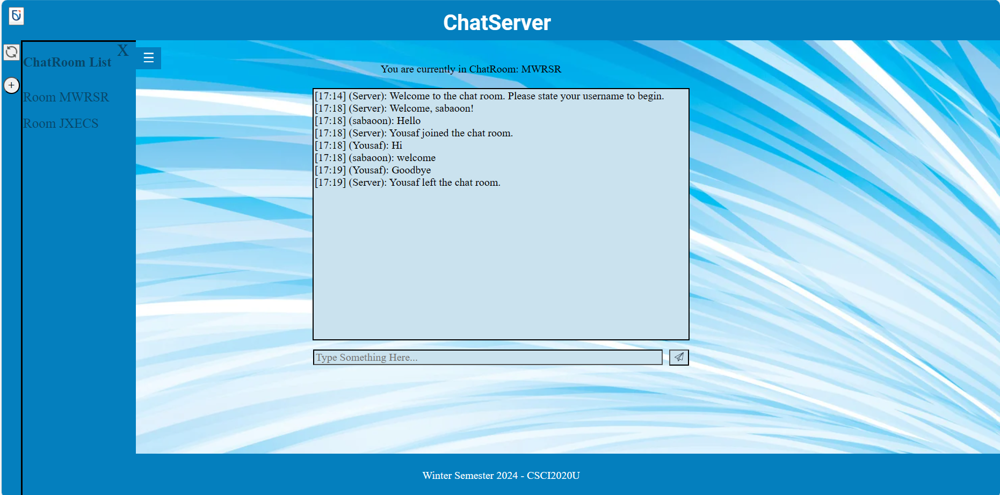
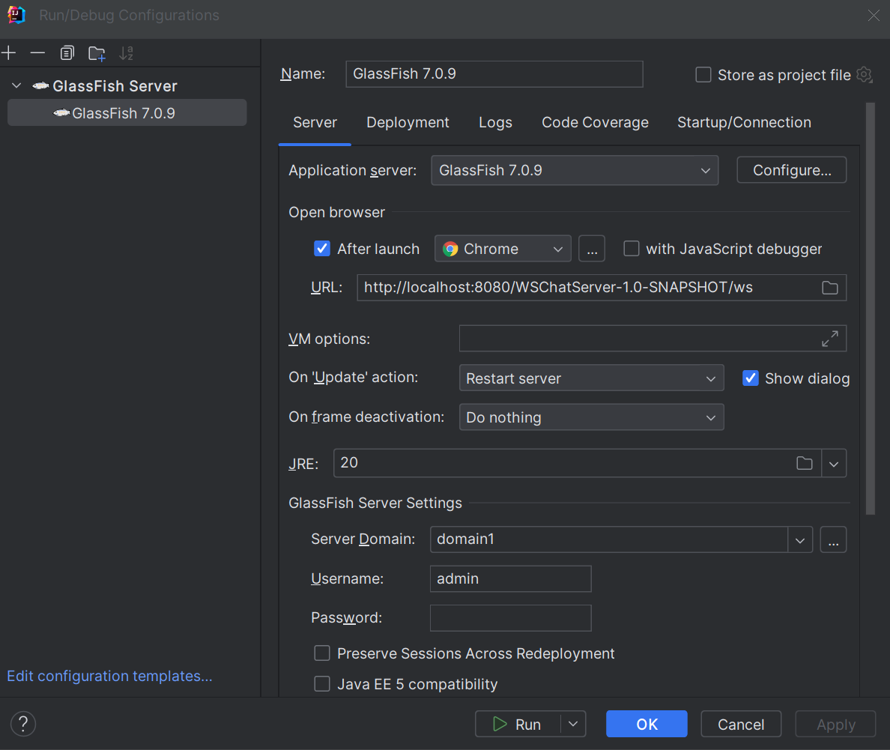
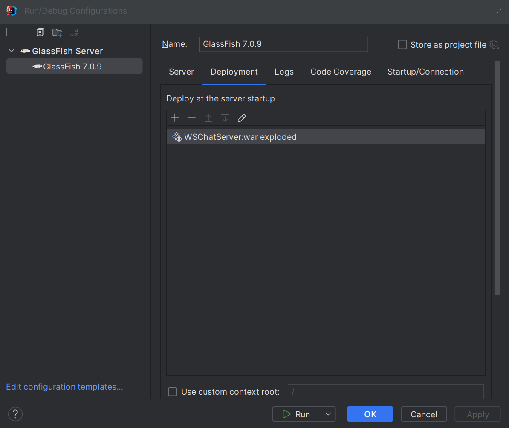
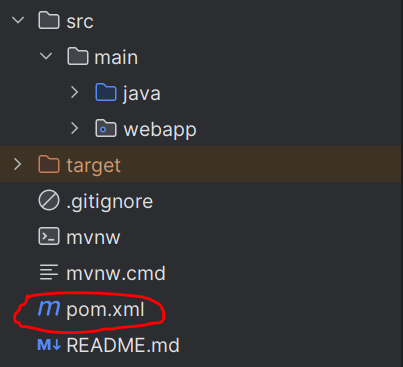

# Assignment 02 - ChatServer

## Project Information
The project is a ChatServer which connects clients and allows communications between them in a manually created chat room. This chatserver allows users to create multiple rooms, which they can join and leave, and rejoin, and communicate between eachother.
This is an image of our working project.

## Video of Project running
<

Group Members:  
Yousaf Jan  
Sabaoon Mohammad Jamil  
Yoosuf Mohamed Kamal

## Improvements
- We designed a toolbar that has buttons with useful functions.
- We designed a Side Navigation bar that opens and closes through the click of a button.
- We designed a button that refreshes the chatroom list.
- We designed our web page so that it has a colour theme (white, blue, black) So that it looks more appealing.
- We designed a button that give the user an alternative method to send messages(send button).
- We made the buttons have a hover effect that displays a tooltip of the buttons function.
- We designed a feature that shows the user what room they are currently in.
- We added an about page that is accessed through an Ontario Tech icon on the top left of the screen.
- We added Github buttons by our names in the about page that takes the user to our respective Github pages.

## How to run
[1] CLone the repository.  
[2] Edit Glass Fish Configurations.  
- Select Local Glass Fish server.  
- Set URL to match image below.  
- Set Domain to domain1  
- Set JRE to 20.0.2  
  
- Under Deployment add artifact: WSChatServer:war exploded.  
- Select ok to make changes.  
  
[3] Run your Glass Fish server.  
[4] Open two index.html files in a browser and in one tab create a room and enter a user name, and in the other tab click on the refesh button so the chat room list updates.  On the second tab join the room put in username and have a splendid conversation with yourself.

### Possible run error fixes
- If artifact: WSChatServer:war exploded does not exist right click on your pom.xml file and click on add as amaven project.  
    
  if your pom.xml file is added as a maven project the file will appear as a blue m.  
  After that add the artifact spamDetector:war exploded.

## Resources
- [W3schools](https://www.w3schools.com/)
- [Websocket](https://jckjaer.dk/2017/06/07/java-websocket-server-in-intellij-idea/)
- [Jet Brains](https://www.jetbrains.com/)

## Contributions
Everyone actively worked together and contributed equally.
Yousaf Jan  (33.3%)
Sabaoon Mohammad Jamil  (33.3%)
Yoosuf Mohamed Kamal  (33.3%)

